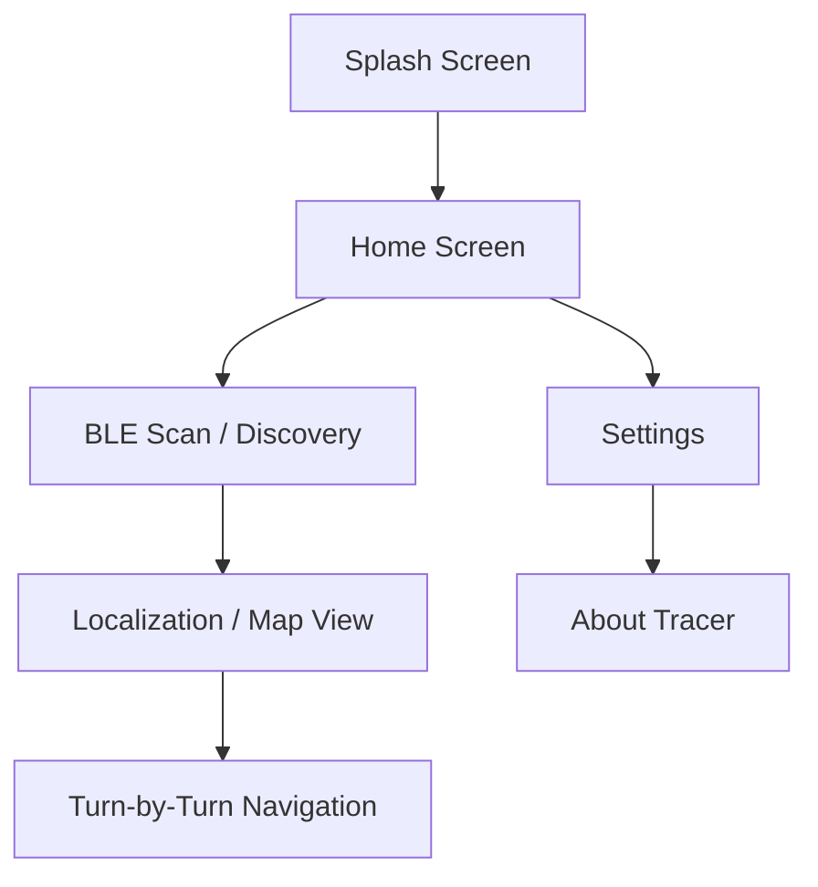

# Tracer Brand Guide

## # Project Information

| Field | Detail |
| :--- | :--- |
| **Project Name** | Tracer |
| **Tagline** | Smart Campus Indoor Navigation |
| **Package Name** | `com.shrihari.smartcampusnavigator` |
| **Platform** | Android (minSdk 29+) |
| **Architecture** | Clean Architecture + MVVM |
| **Technology Stack** | Kotlin, Jetpack Compose, Hilt, Coroutines, StateFlow |
| **Version** | 1.0.0 |
| **Status** | Active Development |
| **Last Updated** | July 18, 2026 |

---

## # Brand Identity

### Mission
To simplify indoor navigation by providing hyper-accurate, AI-driven localization using existing campus infrastructure.

### Vision
To become the standard for smart campus navigation, bridging the gap between outdoor GPS and indoor accessibility.

### Core Values
- **Precision**: Accuracy is the foundation of navigation.
- **Simplicity**: Complex technology delivered through an intuitive interface.
- **Accessibility**: Ensuring every user can find their way, regardless of their familiarity with the campus.

### Brand Personality
Tracer is professional, reliable, and technologically advanced. It feels like a high-end tool that is nonetheless approachable and helpful.

### Tone of Voice
Direct, encouraging, and clear. Avoid jargon in the UI; use precise directions.

### Target Audience
University students, faculty, visitors, and campus staff requiring precise indoor routing.

---

## # Logo

### Meaning
The logo represents the pathfinding nature of the app. The intersecting lines symbolize the convergence of BLE signals to define a precise location.

### Concept
A stylized 'T' that incorporates a beacon signal wave and a location pin silhouette.

### Usage Guidelines
- Maintain high contrast with the background.
- Do not rotate or skew the logo.
- Use the primary color version on light backgrounds and the white version on dark backgrounds.

### Minimum Size
- **Digital**: 24dp x 24dp
- **Print**: 10mm x 10mm

### Clear Space
Minimum clear space is equal to 50% of the logo's width on all sides.

---

## # Official Color Palette

| Color | HEX | Purpose | Usage Example | Accessibility |
| :--- | :--- | :--- | :--- | :--- |
| **Primary** | `#00133A` | Brand Identity, Key Actions | TopAppBar, Primary Buttons | AAA on Light |
| **Secondary** | `#2868A6` | Accents, Highlights | Progress Bars, Active Icons | AA on Light |
| **Neutral** | `#838383` | Secondary Text, Borders | Descriptions, Dividers | AA on Surface |
| **Background**| `#EDEBFF` | Main Screen Background | Scaffold Background | High Contrast |
| **Surface** | `#FFFFFF` | Cards, Sheets, Dialogs | User Info Cards | Standard |
| **Error** | `#B3261E` | Destructive Actions, Alerts| Error Messages, Delete | High Visibility |

---

## # Typography

Tracer uses the **Material 3 (M3)** Typography system for consistency and readability.

| Style | Scale | Weight | Usage |
| :--- | :--- | :--- | :--- |
| **Headline Large** | 32sp | Bold | Splash Screen Title |
| **Headline Medium**| 28sp | Medium | Section Headers |
| **Title Medium** | 16sp | Semi-Bold | Card Titles, Top Bar |
| **Body Large** | 16sp | Regular | Primary Content Text |
| **Body Medium** | 14sp | Regular | Secondary Information |
| **Label Small** | 11sp | Medium | Captions, Metadata |

---

## # Iconography

- **Style**: Material Symbols Rounded.
- **Consistency**: Use 24dp icons for standard actions; 40dp for feature highlights.
- **Meaning**: Icons should be intuitive (e.g., Bluetooth icon for BLE status, Map for localization).

---

## # Design Tokens

### Corner Radii
- **Button Radius**: 100dp (Fully Rounded)
- **Card Radius**: 16dp
- **TextField Radius**: 8dp
- **FAB Radius**: 16dp

### Spacing Scale
- **Extra Small**: 4dp
- **Small**: 8dp
- **Medium**: 16dp (Standard Margin)
- **Large**: 24dp
- **Extra Large**: 32dp

### Elevation
- **Level 0**: 0dp (Flat)
- **Level 1**: 1dp (Surface Tint)
- **Level 2**: 3dp (Standard Cards)

---

## # UI Principles

1. **Minimal**: Only show information the user needs for their current step.
2. **Professional**: Use clean lines and a disciplined color palette.
3. **Consistent**: Reusable components must look and behave identically across the app.
4. **Accessibility First**: Prioritize touch target sizes (min 48dp) and contrast ratios.
5. **Modern**: Utilize Material 3 motion and surface color logic.

---

## # Component Guidelines

- **Buttons**: Use Filled buttons for primary actions, Outlined for secondary.
- **Cards**: Use Elevated cards for interactive items, Outlined for static groupings.
- **Top App Bar**: Use `CenterAlignedTopAppBar` for main screens; standard for sub-screens.
- **Bottom Navigation**: Reserved for high-level module switching (Map, Search, Settings).

---

## # Splash Screen Guidelines

- **Background**: `TracerPrimary` (`#00133A`)
- **Logo**: Centered, 120dp wide.
- **Title**: "Tracer" in `White`, Headline Large, 16dp below logo.
- **Subtitle**: "Smart Campus Indoor Navigation", Label Small, 8dp below title.
- **Loading**: Indeterminate linear progress at the very bottom of the screen.

---

## # Home Screen Guidelines

1. **Header**: "Tracer" branding with BLE connectivity status icon.
2. **Current Location Card**: Prominent surface showing the detected zone/room.
3. **Primary Action**: "Start Scan" Floating Action Button or large central button.
4. **Recent Activity**: List of recently visited locations or saved paths.

---

## # Navigation Structure

---

## # Empty States
- **Illustration**: Simple, centered line-art icon (Primary Neutral).
- **Text**: "No Beacons Found" or "No Active Scans".
- **Action**: A "Retry" or "Start Scan" button below the text.

---

## # Loading States
- **Full Screen**: Centered circular progress indicator with the Tracer Secondary color.
- **Skeleton Views**: Used for location cards while RSSI values are being filtered.

---

## # Error States
- **Banner**: Used for non-blocking errors (e.g., "Bluetooth is Off").
- **Dialog**: Used for critical failures (e.g., "Location Services Denied").
- **Color**: Always use `TracerError` (`#B3261E`).

---

## # Accessibility Guidelines
- **Contrast**: Maintain a minimum 4.5:1 ratio for text.
- **Touch Targets**: Minimum 48x48dp for all interactive elements.
- **TalkBack**: Content descriptions for all icons and images.

---

## # GitHub Branding
- **Badges**: Project status, Version, License.
- **Screenshots**: Home, Map, and BLE Scan views must be in the main `README.md`.
- **Logo**: Use the `branding/logo/logo_primary.png` for the repo header.

---

## # Version History

### Version 1.0.0
- Brand identity defined.
- Primary and Secondary color palette locked.
- Material 3 design tokens established.
- Initial UI guidelines for Home and Splash screens finalized.
